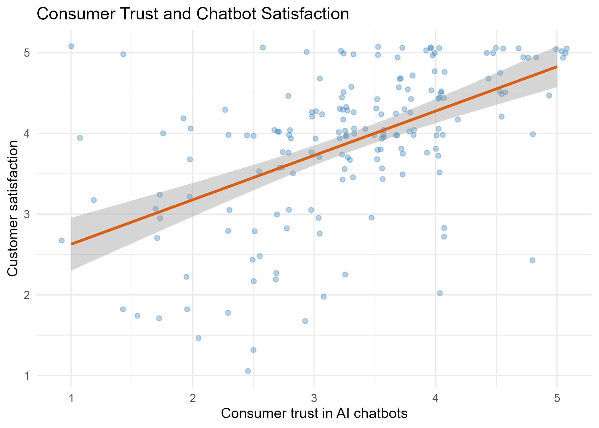
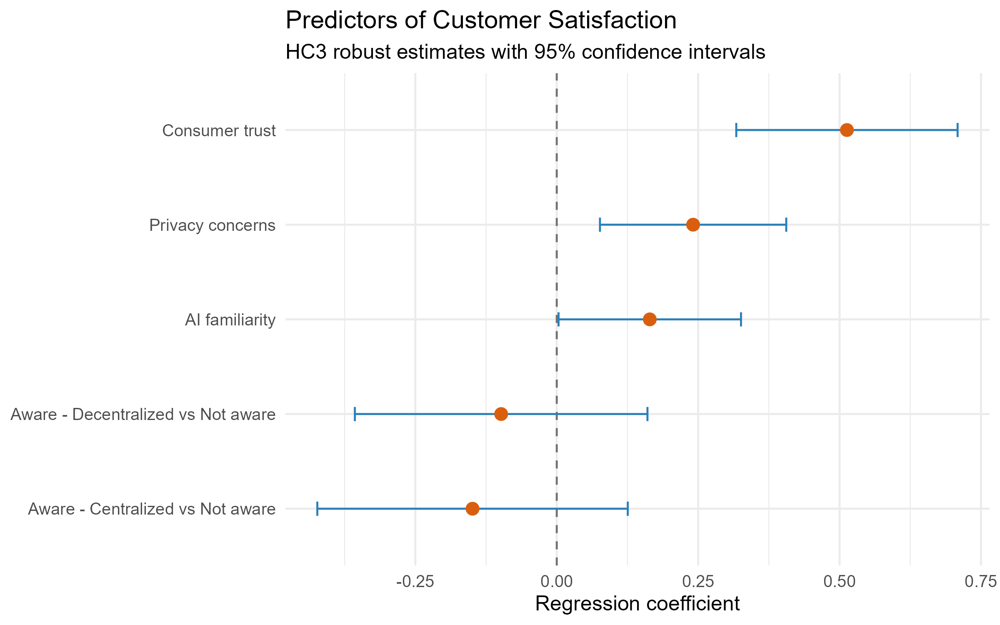

```{r setup, include=FALSE}
knitr::opts_chunk$set(
  echo = FALSE,
  warning = FALSE,
  message = FALSE
)

library(tidyverse)
library(readxl)
library(janitor)
library(psych)
library(lmtest)
library(sandwich)
library(emmeans)

source("01_data_import.R")
source("02_descriptive_analysis.R")
source("03_reliability_analysis.R")
source("04_correlation_analysis.R")
source("05_regression_analysis.R")
source("06_interaction_analysis.R")
source("07_model_diagnostics.R")
source("08_sensitivity_analysis.R")
source("09_visualisations.R")
```

# Abstract
AI-powered chatbots are increasingly used in customer service, yet consumer satisfaction may depend on psychological and technological factors beyond consumers’ awareness of the chatbot type. This study examined whether consumer trust, privacy concerns, AI familiarity, and chatbot awareness category predicted satisfaction with AI-powered chatbots and whether awareness category moderated these relationships. A quantitative secondary analysis was conducted using an openly available dataset containing 175 responses across three groups: Not aware, Aware - Centralized, and Aware - Decentralized. Descriptive statistics, reliability analysis, Pearson correlations, multiple regression, moderation analysis, model diagnostics, and sensitivity analysis were conducted in R. HC3 heteroskedasticity-robust standard errors were used for primary statistical inference. The main-effects model explained 36.2% of the variance in customer satisfaction. Consumer trust was the strongest positive predictor of satisfaction, followed by privacy concerns and AI familiarity. Chatbot awareness category did not significantly predict satisfaction after controlling for these variables. Although conventional inference initially suggested possible moderation, the interaction terms were not jointly significant under HC3 robust inference. The findings remained stable when the analysis was restricted to the 170 completed responses. Overall, consumer trust appears more strongly associated with chatbot satisfaction than chatbot awareness category. The findings are correlational and should be confirmed using larger longitudinal or experimental studies.

**Keywords:** AI-powered chatbots, consumer trust, privacy concerns, AI familiarity, customer satisfaction, chatbot awareness

# Introduction
AI-powered chatbots are increasingly used to provide automated customer service through text-based conversations. They can offer rapid and continuous assistance, but their effectiveness depends on how consumers evaluate the interaction. Customer satisfaction is particularly important because it can influence whether consumers continue using chatbot-based services. Previous research found that information quality and service quality positively influence chatbot satisfaction and that satisfaction predicts continued use (Ashfaq et al., 2020).

Trust is likely to be central to this evaluation. Consumers must rely on a chatbot to understand their requests and provide accurate and appropriate assistance. Research on customer-service chatbots has identified response quality, professional presentation, host-brand reputation, security, and privacy as factors affecting user trust (Følstad et al., 2018). Greater trust may therefore be associated with greater satisfaction with the chatbot experience.

Privacy is another important consideration because chatbot interactions may involve the disclosure and processing of personal information. Cheng and Jiang (2020) found that perceived privacy risk negatively predicted satisfaction in a large sample of chatbot users. However, privacy awareness and satisfaction may not always operate as simple opposites. Consumers may value a chatbot’s usefulness while simultaneously remaining concerned about its handling of personal information. Examining privacy concerns alongside trust may therefore provide a more complete understanding of chatbot satisfaction.

Consumers’ familiarity with AI may also shape their responses. Familiar users may better understand the capabilities and limitations of chatbots and may interact with them more confidently. Awareness of the type or identity of a chatbot may also be relevant. For example, Luo et al. (2019) found that disclosing chatbot identity could reduce customer purchases, although prior AI experience helped mitigate this effect. Although identity disclosure is not identical to the awareness categories examined in the present dataset, this evidence suggests that consumers’ awareness and prior AI experience may be relevant to their evaluations of chatbot interactions.

The present study conducts an independent secondary analysis of an openly available dataset to examine consumer trust, privacy concerns, AI familiarity, and chatbot awareness category together as predictors of customer satisfaction. It also tests whether the relationships between the three continuous predictors and satisfaction differ across the Not aware, Aware - Centralized, and Aware - Decentralized groups.

## Research Question
How are consumer trust, privacy concerns, AI familiarity, and chatbot awareness category associated with satisfaction with AI-powered chatbots, and does chatbot awareness category moderate the relationships between the continuous predictors and satisfaction?

## Hypotheses
- H1: Consumer trust is positively associated with customer satisfaction.
- H2: Privacy concerns are significantly associated with customer satisfaction.
- H3: AI familiarity is positively associated with customer satisfaction.
- H4: Customer satisfaction differs across chatbot awareness categories.
- H5: Chatbot awareness category moderates the relationships between consumer trust, privacy concerns, AI familiarity, and customer satisfaction.

# Method
## Research Design and Data Source
This study used a quantitative, cross-sectional secondary-data analysis to examine factors associated with consumer satisfaction with AI-powered chatbots. The analysis used an openly available dataset originally collected for a master’s thesis on consumer responses to AI-powered chatbots. The dataset was downloaded from Figshare and is available under a Creative Commons Attribution 4.0 licence (Aytemir, 2024). The present study represents an independent reanalysis guided by a distinct research question focusing on consumer trust, privacy concerns, AI familiarity, and chatbot awareness category as predictors of customer satisfaction. As the data were collected previously and accessed in anonymised form, no new participants were recruited or contacted for this project.

## Participants
The dataset contained responses from 175 participants. Of these, 170 were recorded as having completed the original survey and five as unfinished. However, all 175 participants had complete data for the variables used in the present analysis; therefore, the full sample was retained for the primary analyses. A sensitivity analysis using only the 170 completed responses was also conducted to assess the robustness of the findings. Participants were distributed across three chatbot awareness categories: Not aware (n = 54), Aware - Centralized (n = 62), and Aware - Decentralized (n = 59).

## Measures
Customer satisfaction was measured using four items (`CS_1`–`CS_4`). Consumer privacy concerns were measured using three items (`CPC_1`–`CPC_3`), consumer trust in AI chatbots was measured using four items (`CT_1`–`CT_4`), and AI familiarity was measured using two items (`AIF_1`–`AIF_2`). For each construct, a composite score was calculated as the mean of its corresponding items. Higher scores indicated higher levels of the relevant construct.

Chatbot awareness category was treated as a categorical variable with three groups: Not aware, Aware - Centralized, and Aware - Decentralized. Not aware was used as the reference category in the regression analyses.

Internal consistency was assessed using Cronbach’s alpha. Reliability was good for customer satisfaction (α = .860), privacy concerns (α = .807), and consumer trust (α = .808). AI familiarity demonstrated lower internal consistency (α = .618); therefore, findings involving this two-item measure were interpreted cautiously.

## Data Analysis
All analyses were conducted in R. Data were imported, cleaned, and inspected for missing values, duplicate participant identifiers, survey-completion status, and group sizes. Descriptive statistics and Cronbach’s alpha coefficients were calculated for the key study variables. Pearson correlation analysis was then used to examine bivariate relationships among customer satisfaction, privacy concerns, consumer trust, and AI familiarity.

A multiple linear regression model examined whether privacy concerns, consumer trust, AI familiarity, and chatbot awareness category predicted customer satisfaction. A second model added interactions between each continuous predictor and chatbot awareness category to test moderation. The main-effects and interaction models were compared using a nested-model test.

Model diagnostic plots indicated non-constant residual variance. Therefore, heteroskedasticity-consistent HC3 standard errors were used for the primary statistical inferences. Cook’s distance was examined for the interaction model to identify potentially influential observations. Twenty-one observations exceeded the conservative screening threshold of 4/*n*, but the maximum Cook’s distance was 0.281 and no observation exceeded .50 or 1.00. Because the 4/*n* threshold is a screening guideline rather than an automatic basis for case deletion, all observations were retained.

Finally, a sensitivity analysis repeated the main-effects and interaction analyses using only the 170 responses marked as completed. This assessed whether retaining the five unfinished responses affected the conclusions.

# Results
## Data Quality and Descriptive Statistics
The dataset contained 175 responses with 175 unique participant identifiers, indicating that no duplicate responses were present. Five responses were recorded as unfinished; however, none of the variables included in the present analysis contained missing values. Therefore, all 175 responses were retained for the primary analyses.

Overall, customer satisfaction had a mean of 3.89 (SD = 0.92), privacy concerns had a mean of 3.73 (SD = 0.98), consumer trust had a mean of 3.30 (SD = 0.88), and AI familiarity had a mean of 3.21 (SD = 0.85). All four variables ranged from 1 to 5.

```{r descriptive-table}
knitr::kable(
  descriptive_table,
  caption = "Descriptive Statistics for the Study Variables",
  col.names = c("Variable", "Mean", "SD", "Minimum", "Maximum"),
  align = "lcccc"
)
```
Descriptively, participants in the Not aware group reported the highest mean customer satisfaction (M = 4.05), followed by the Aware - Decentralized group (M = 3.92) and the Aware - Centralized group (M = 3.73). These unadjusted differences are descriptive and should not, by themselves, be interpreted as statistically significant group effects.

## Reliability Analysis
The customer satisfaction, privacy concerns, and consumer trust scales demonstrated good internal consistency. Customer satisfaction had the highest reliability (α = .860), followed by consumer trust (α = .808) and privacy concerns (α = .807). The reliability of the two-item AI familiarity measure was comparatively low (α = .618); therefore, results involving this variable should be interpreted cautiously.
```{r reliability-table}
knitr::kable(
  reliability_results,
  digits = 3,
  caption = "Internal Consistency of the Study Measures",
  col.names = c("Scale", "Cronbach's Alpha"),
  align = "lc"
)
```
## Correlation Analysis
Pearson correlation analysis indicated that consumer trust had a moderate positive relationship with customer satisfaction, *r* = .53, *p* < .001. AI familiarity also had a positive relationship with satisfaction, *r* = .33, *p* < .001. Privacy concerns had a weak positive relationship with satisfaction, *r* = .16, *p* = .032.

Consumer trust was positively related to AI familiarity, *r* = .41, *p* < .001. The relationships between privacy concerns and consumer trust (*r* = −.15, *p* = .051) and between privacy concerns and AI familiarity (*r* = −.10, *p* = .187) were not statistically significant.
```{r correlation-table}
correlation_matrix <- round(correlation_results$r, 2)

knitr::kable(
  correlation_matrix,
  caption = "Pearson Correlations Among the Study Variables",
  align = "lcccc"
)
```
*Note.* Satisfaction = customer satisfaction; Privacy = consumer privacy concerns; Trust = consumer trust in AI chatbots; AI_Familiarity = AI familiarity.
```{r trust-satisfaction-figure, fig.cap="Relationship Between Consumer Trust and Customer Satisfaction", out.width="80%"}

```
## Multiple Regression Analysis
The multiple regression model was statistically significant, *F*(5, 169) = 19.16, *p* < .001, explaining 36.2% of the variance in customer satisfaction (*R*² = .362, adjusted *R*² = .343). Because the diagnostic analysis indicated non-constant residual variance, HC3 heteroskedasticity-robust standard errors were used for coefficient-level inference.

Consumer trust was the strongest positive predictor of customer satisfaction (*B* = 0.513, robust *SE* = 0.100, *p* < .001). Privacy concerns were also positively associated with satisfaction (*B* = 0.241, robust *SE* = 0.084, *p* = .005). AI familiarity had a smaller positive association with satisfaction (*B* = 0.165, robust *SE* = 0.082, *p* = .047).

Compared with the Not aware group, neither the Aware - Centralized group (*B* = −0.149, *p* = .289) nor the Aware - Decentralized group (*B* = −0.098, *p* = .458) significantly predicted customer satisfaction after controlling for the continuous predictors.
```{r robust-regression-table}
regression_table <- tibble(
  Predictor = rownames(robust_main_coefficients),
  B = as.numeric(robust_main_coefficients[, 1]),
  Robust_SE = as.numeric(robust_main_coefficients[, 2]),
  t_value = as.numeric(robust_main_coefficients[, 3]),
  p_value = as.numeric(robust_main_coefficients[, 4])
) |>
  mutate(
    across(where(is.numeric), ~ round(.x, 4))
  )

knitr::kable(
  regression_table,
  caption = "Multiple Regression Results Using HC3 Robust Standard Errors",
  col.names = c("Predictor", "B", "Robust SE", "t", "p"),
  align = "lcccc"
)
```
```{r coefficient-figure, fig.cap="HC3 Robust Regression Coefficients with 95% Confidence Intervals", out.width="80%"}

```
## Moderation Analysis
An interaction model was estimated to examine whether chatbot awareness category moderated the relationships between privacy concerns, consumer trust, AI familiarity, and customer satisfaction. Under conventional standard errors, adding the six interaction terms improved model fit, *F*(6, 163) = 2.32, *p* = .035, increasing explained variance from *R*² = .362 to *R*² = .412.

However, this result was not supported when HC3 robust standard errors were used. The robust joint Wald test indicated that the interaction terms did not collectively improve the model, *F*(6, 163) = 1.19, *p* = .316. Therefore, the apparent moderation effect under conventional standard errors was considered sensitive to heteroskedasticity. The study consequently found no robust evidence that chatbot awareness category moderated the relationships between the three continuous predictors and customer satisfaction.

Accordingly, the main-effects model was treated as the primary and more parsimonious model. Although some unadjusted and conventional interaction results suggested possible differences between chatbot groups, these findings were not sufficiently robust to support the moderation hypothesis.

## Sensitivity Analysis
A sensitivity analysis was conducted using only the 170 responses recorded as completed. The findings were consistent with those obtained from the full sample. Consumer trust remained the strongest positive predictor of customer satisfaction (*B* = 0.532, robust *SE* = 0.102, *p* < .001). Privacy concerns also remained significant (*B* = 0.228, robust *SE* = 0.084, *p* = .008), while AI familiarity retained a smaller positive association (*B* = 0.169, robust *SE* = 0.084, *p* = .047).

chatbot awareness category remained non-significant. In addition, the HC3 robust comparison between the main-effects and interaction models remained non-significant, *F*(6, 158) = 1.00, *p* = .425. Therefore, including the five responses marked as unfinished did not materially affect the study’s conclusions.

Overall, the sensitivity analysis supported the stability of the primary results.

# Discussion
## Key Findings
This study examined whether consumer trust, privacy concerns, AI familiarity, and chatbot awareness category were associated with customer satisfaction with AI-powered chatbots. Consumer trust emerged as the strongest predictor of satisfaction. Participants reporting greater trust in AI chatbots also tended to report higher satisfaction, supporting H1.

Privacy concerns were also positively associated with satisfaction, supporting the non-directional prediction in H2. This positive relationship may initially appear unexpected, as privacy concerns are often assumed to reduce favourable consumer responses. One possible interpretation is that consumers who engage more closely with AI chatbots may simultaneously report greater satisfaction and greater awareness of privacy-related issues. However, the cross-sectional data cannot determine the direction or underlying cause of this relationship.

AI familiarity demonstrated a smaller positive association with satisfaction, providing support for H3. This result should nevertheless be interpreted cautiously because its statistical significance was close to the .05 threshold and the two-item AI familiarity measure had comparatively low reliability (α = .618).

After accounting for trust, privacy concerns, and AI familiarity, chatbot awareness category was not significantly associated with satisfaction. Therefore, H4 was not supported. Although the conventional interaction model initially indicated possible moderation, the interaction terms were not jointly significant when HC3 robust inference was applied. H5 was consequently not supported. The sensitivity analysis using only completed responses produced the same overall conclusions.

These findings represent statistical associations rather than causal effects because the study used cross-sectional secondary data.

## Theoretical and Practical Implications
The findings suggest that consumers’ evaluations of AI chatbots may depend more strongly on trust and prior familiarity than on the chatbot awareness category itself. Consumer trust was substantially more strongly associated with satisfaction than either awareness category or AI familiarity. This highlights trust as a central factor in understanding consumer responses to AI-powered service technologies.

The positive association between privacy concerns and satisfaction also indicates that privacy awareness and satisfaction may coexist rather than operate as simple opposites. Consumers can potentially appreciate the usefulness of an AI chatbot while remaining concerned about how their personal information is collected, processed, or stored. Future research should investigate the mechanisms underlying this relationship.

From a practical perspective, organisations introducing AI-powered chatbots should prioritise features that can strengthen consumer trust. These may include accurate and consistent responses, clear explanations of the chatbot’s capabilities and limitations, transparent data-handling information, and accessible options for human assistance. Organisations should also provide simple guidance to consumers who have limited familiarity with AI systems.

The non-significant effects of chatbot awareness category indicate that satisfaction did not differ significantly according to whether participants were unaware of the chatbot type or aware that they were interacting with a centralized or decentralized chatbot. However, because awareness was analysed as an observed category rather than as an independently manipulated intervention in the present secondary analysis, this finding should not be interpreted as evidence that changing a disclosure label would have no effect. The overall quality, reliability, transparency, and usability of the interaction may remain important considerations for customer satisfaction.

## Limitations and Future Research
Several limitations should be considered. First, the study used cross-sectional secondary data; therefore, temporal order and causal relationships cannot be established. For example, greater trust may increase satisfaction, but satisfactory chatbot experiences may also strengthen consumer trust.

Second, the variables were measured using self-reported survey responses, which may be affected by response bias and common-method variance. The analysis was also limited to the variables available in the original dataset and could not control for every factor that may influence chatbot satisfaction.

Third, the AI familiarity scale contained only two items and demonstrated relatively low internal consistency (α = .618). Findings involving AI familiarity should therefore be interpreted cautiously. Future studies should use a broader, well-validated measure covering different dimensions of AI knowledge and experience.

Fourth, the chatbot groups were relatively modest in size, which may have limited the statistical power to detect interaction effects. The residual diagnostics also indicated heteroskedasticity. Although HC3 robust standard errors were used to address this issue, replication with a larger and more diverse sample would strengthen confidence in the findings.

Finally, five responses were marked as unfinished in the original dataset. All five contained complete data for the variables analysed, and excluding them did not materially alter the findings. Nevertheless, the completed-response analysis was retained as a robustness check.

Future research could use longitudinal or experimental designs to examine whether changes in trust and AI familiarity lead to changes in satisfaction. Researchers could also investigate mechanisms such as perceived usefulness, perceived risk, transparency, response accuracy, and prior chatbot experience. Replication across different industries, countries, chatbot designs, and consumer groups would help assess the generalisability of the results.

# Conclusion
This study examined consumer trust, privacy concerns, AI familiarity, and chatbot awareness category as predictors of satisfaction with AI-powered chatbots. Consumer trust emerged as the strongest and most consistent positive predictor of satisfaction. Privacy concerns also demonstrated a positive association, while AI familiarity had a smaller and less reliable positive relationship with satisfaction.

Customer satisfaction did not differ significantly between participants who were unaware of the chatbot type and those who were aware that they were interacting with a centralized or decentralized chatbot, after accounting for the continuous predictors. Moreover, there was no robust evidence that chatbot awareness category moderated the relationships between trust, privacy concerns, AI familiarity, and satisfaction. These conclusions remained stable when the analysis was restricted to completed survey responses.

Overall, the findings suggest that trust is more strongly associated with customer satisfaction than chatbot awareness category. However, the results represent associations rather than causal effects and should not be interpreted as evidence that changing chatbot disclosure practices would have no effect. The findings should be confirmed through larger longitudinal or experimental studies.

# Data and Code Availability
The source dataset is publicly available from Figshare at https://doi.org/10.6084/m9.figshare.26068954 under a Creative Commons Attribution 4.0 licence. To avoid duplicating the source dataset, the raw Excel file is not included in the public project repository; users should download it directly from Figshare and place it in the `Data` folder before running the analysis. All R scripts used for data preparation, descriptive analysis, reliability testing, correlation analysis, regression, moderation, diagnostic checks, sensitivity analysis, visualisation, and result export are included in this project.

# References
Ashfaq, M., Yun, J., Yu, S., & Loureiro, S. M. C. (2020). I, chatbot: Modeling the determinants of users’ satisfaction and continuance intention of AI-powered service agents. *Telematics and Informatics, 54*, 101473. https://doi.org/10.1016/j.tele.2020.101473

Aytemir, Z. (2024). *Dataset for master’s thesis: AI-powered chatbots* [Data set]. Figshare. https://doi.org/10.6084/m9.figshare.26068954

Cheng, Y., & Jiang, H. (2020). How do AI-driven chatbots impact user experience? Examining gratifications, perceived privacy risk, satisfaction, loyalty, and continued use. *Journal of Broadcasting & Electronic Media, 64*(4), 592–614. https://doi.org/10.1080/08838151.2020.1834296

Følstad, A., Nordheim, C. B., & Bjørkli, C. A. (2018). What makes users trust a chatbot for customer service? An exploratory interview study. In S. S. Bodrunova (Ed.), *Internet Science* (pp. 194–208). Springer. https://doi.org/10.1007/978-3-030-01437-7_16

Luo, X., Tong, S., Fang, Z., & Qu, Z. (2019). Frontiers: Machines vs. humans: The impact of artificial intelligence chatbot disclosure on customer purchases. *Marketing Science, 38*(6), 937–947. https://doi.org/10.1287/mksc.2019.1192